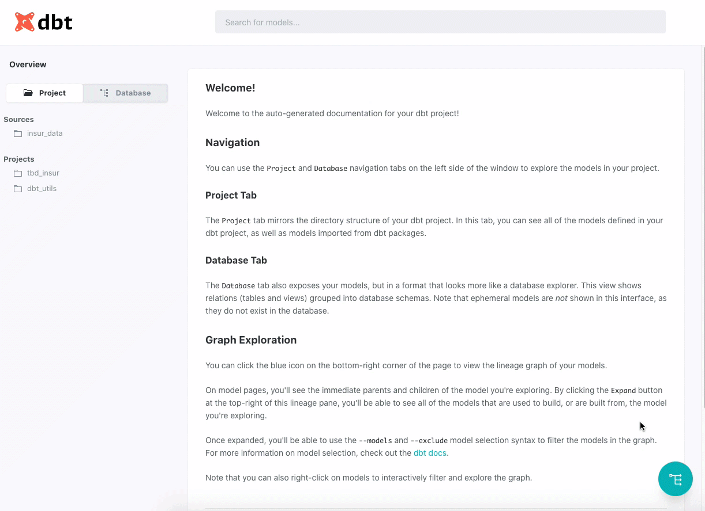

The goal of this quick project is simply to demonstrate some fundamental [dbt](https://www.getdbt.com/) concepts. 

#### Quick Note; Reliance on docker
This project relies on docker to get around the worry of having to ensure a systems is configured properly or going through the steps of setting up a virtual environment within a given OS.  
Docker is used to dev / serve the dbt workflow and is used to set up the database (PostgresSQL) the project connects to. For more information on docker and how to install see [here](https://www.docker.com/products/docker-desktop)

### Goals of the project
- Demonstrate basic setup and configuration
- Show the workflow for developing simple data models
- Demonstrate dbt built-in documentation features

## Step 1: Set up a database
First step of the project is to set up a database in order to store and access data. DBT is not universally compatible with all databses, but is compatible with popular choices. For this project I went with a Postgres db. In order to launch the db, you can run the following docker code in terminal to get it launched and running locally. 

```docker
#set up postgres docker image
docker run --name pg_local -p 5432:5432 \
-e POSTGRES_USER=tbd_insur -e POSTGRES_PASSWORD=insur_pw \
-e POSTGRES_DB=tutorial -d postgres:12.2
```

Take note of the username and password above, as this is needed when configuring DBT.  

## Step 2: Configure DBT to access postgres database

### Configure connection to databse
To set up access to databses, dbt requires a profiles.yml file typically stored in ~/.dbt . Since this projct will be ran in docker, you can place the profiles.yml file in the main level of the repo, as it will be mounted into the docker iamge. the basic set up for the file is as follows. 

```yml
tbd_insur:
  outputs:
    dev:
      type: postgres
      threads: 1
      host: 172.17.0.1
      port: 5432
      user: tbd_insur
      pass: insur_pw
      dbname: tutorial
      schema: insur_data
  target: dev
```

A few things to note from above:

- The user name and password match what was passed when creating the postgres docker image. 
- tbd_insur is a profile name that needs to match the profile name set up in dbt_projects.yml (more below).
- For me, host needs to be set to 172.17.0.1 in order to access the database from within the docker image.
- `dbname` and `schema` do not need to be pre-specified in the the postgres databse. DBT will handle creating them if they do not exist. 
- It is very bad practice to set hard code in credentials. A better approach is to set environmental variables and pull in. 

After creating the profile.yml file the rest of the project can be created from the files in this repo. 


## Step 3: Create DBT docker image

Once this repo has been pulled navigate a terminal into the repo directory where there dockerfile is present. Once in the docker image run the following docker command:

```docker
docker build . -t dbt_example
```

The above code builds a docker image based on the code present in `dockerfile`:

```docker
FROM python:3.8.5

# Update and install system packages
RUN apt-get update -y && \
  apt-get install --no-install-recommends -y -q \
  git libpq-dev python-dev && \
  apt-get clean && \
  rm -rf /var/lib/apt/lists/* /tmp/* /var/tmp/*

# Install DBT
RUN pip install -U pip
RUN pip install dbt==0.19.0

# Set environment variables
ENV DBT_DIR /dbt

# Set working directory
WORKDIR $DBT_DIR

#Expose port 8080 for dbt documentation
EXPOSE 8080
```

The above code creates a docker image called `dbt_example` that we can use to launch the dbt projcts. Before launching you will need to identify the location of your profiles.yml file and the repo location. 

To launch the docker image run docker command:

``` docker
docker run -p 8080:8080 --name dbt -it -d \
-v /Users/codycooper/.dbt/profiles.yml:/root/.dbt/profiles.yml \
-v /Users/codycooper/Documents/GitHub/dbt-example:/dbt \
-d dbt_example:latest
```

Note you'll need to adjust each path after `-v` to wherever you have the two files saved, so that they are appropriately mounted into the docker image. 

Afer running the above you should have a functioning docker image that can be used to explore the dbt project / environment. 

Generally, the dockerfile or image would be configured to execute commands on launch. For the purpose of this tutorial, I am simply going enter the docker image and manually show how to run some standard dbt commands. 

To test if the project code has been set up correctly run:

```dbt
dbt compile
```

To run all of the models and see them in the postgres databse run:

```
dbt run
```
### Basics of this simple dbt project. 
The data pipeline built in this project is not particularly sophisticated. What it does is provide a preview for how this can be used to create sophisticated analytic pipelines. The main process established in this project is in the `/models` folder. 

DBT is oriented around creating data models. These data models are represented as `.sql` files, which contain the business logic used to prepare data. More impressively, dbt manages the order in wihch these models need to be created by genearating a directed acyclical graph (DAG) as models are built. Meaning, the user does not have to worry about specifying and managing the order in wihch models are executed. This will be visualized in the documentation just below. 

DBT also supports the use of pre-existing packages for transforming data. This allows for jump starting and quickly extending analytic capabilities. As an exmpale, this project uses the popular dbt_utils package (specified in the packages.yml of this repo). This package provides convenitent functions ot make processing and transforming data easier. For example,  `models/staging/pivot_travel_insurance_metrics.sql` uses the `dbt_utils.pivot()` function to quickly and easily create a pivot table. This would typically require writing a series of `CASE WHEN` statemetns for each of the values. 

### documentation

The largest impact that dbt can have an organizations is perhaps in its built in documentation features. This allows analysts, engineers, and decision makers to have a common soruce to reflect analytic pipelines and provide clear definitions of how data is flowing into decision making arens (e.g. Dashboards, predictive modeling, etc.).   

From inside the docker image, run the following to generate and serve the documentation:

```
dbt docs generate

dbt docs serve
```

After running the serve command, you can view documentation by navigating to http://localhost:8080/




### Resources highlighted by DBT:
- Learn more about dbt [in the docs](https://docs.getdbt.com/docs/introduction)
- Check out [Discourse](https://discourse.getdbt.com/) for commonly asked questions and answers
- Join the [chat](http://slack.getdbt.com/) on Slack for live discussions and support
- Find [dbt events](https://events.getdbt.com) near you
- Check out [the blog](https://blog.getdbt.com/) for the latest news on dbt's development and best practices
